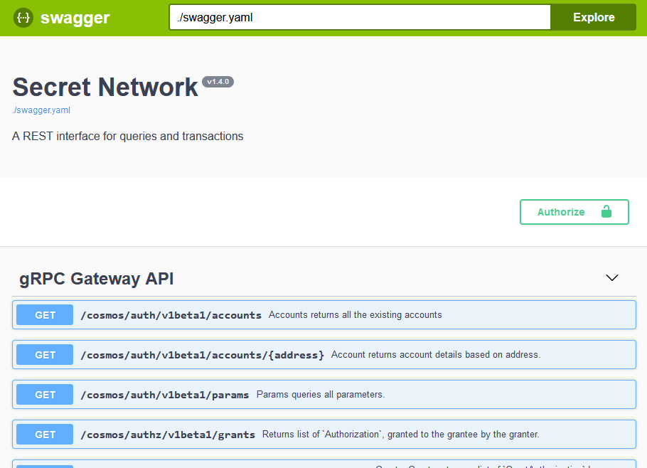

# Secret Blueprint Box 

The Secret Blueprint Box is a Gitpod-enabled quickstart for dapp development on [Secret Network](https://scrt.network).

It consists of a frontend (Vue + Vite + Typescript) and a secret contract (Rust + Secret CosmWasm), based on the [secret counter template](https://github.com/secretuniversity/secret-template-cw1), that you will use to create your own _Secret Box_ for other developers!

If you're comfortable with basic UI/UX design, we encourage you to create that as part of  your _Secret Box_ implementation. You can also request assitance from the Secret Unversity team to help design your DApp frontend.

This _Secret Blueprint Box_ comes with a very basic design. Also, feel free to swap out the frontend stack for something you prefer (e.g. React, Svelte).

The guide is displayed as part of the frontend, with the tutorial steps in the left column, the _Secret Box DApp_ to the right and the tutorial content below that. You'll be modifying this guide markdown so that it follows the content specific to your box. Your box's frontend code will primarily go [here](`/app/src/components/SecretBox.vue`).


## What is a Secret Box?

Secret Boxes are quickstarts or blueprints that contain everything you need to start developing on Secret Network.

- They are intended to be run in a developer sandbox environment--so you don't have to worry about installing various tooling and frameworks. Because they can be launched in a developer sandbox environment, they can be configured to perform automated tasks such as starting `localsecret` (dockerized Secret Network), compiling your secret contract, deploying and more.

*For Gitpod, see the `.gitpod.yml` configuration at the root of the project. There are additional versions that: 1) launch the `LocalSecret` blockchain on Gitpod workspace startup (`.gitpod.yml.localsecret`) and 2) automates the process of launching the local blockchain, compiling and deploying and creating the secret counter contract, and lastly, starting the frontend server.*

- In addition to the secret contract, each box comes with a professionally-designed and implemented frontend, which includes a basic UI/UX kit.

*This lets you, as the developer, focus on building and can reduce the time it takes to evolve and deploy it as your own Secret App because you don't have to worry about the design. If you are a developer that can also design and implement the UI/UX for your app, you are a special breed indeed. For many developers, this skillset isn't quite in their wheelhouse. One of the major goals for Secret Boxes is to address this need in the Secret Network developer community.*

- As a _Secret Box_ developer you have the flexibility of designing your guide so that developers can setup a local environment, if they prefer. And we have these guides pre-written to help you with that, which you can modify to suit your needs:

  - [setting-up-your-environment](/docs/setting-up-your-environment.md)
  - [setting-up-your-gitpod-workspace](/docs/setting-up-your-gitpod-workspace.md)

## Creating a Secret Box

Creating a Secret Box involves one part coding and one part technical, and possibly creative, writing. It includes developing the tutorial for the box and implementing at least part or all of the secret contract and frontend code.

> if you want to have the developer complete aspects of the box code as part of the tutorial, you can tailor it to include those instructions. Or, you can walk the developer through the completed box code and then give additional instructions or notes on how to evolve it.


#### Setup Your Local Developer Environment

This [Setting Up Your Environment](/docs/setting-up-your-environment.md) guide will walk you through setting up your local environment so you can start creating your _Secret Box_.


#### Writing Your Guide

_Secret Box_ tutorials are written using Markdown and can be found in the [tutorial](/app/tutorial/) directory of this repo.

The tutorial content is placed in `app/tutorial/guide.md` with any accompanying images kept in the `app/tutorial/illustrations` directory.

> If your _Secret Box_ requires the developer to modify code, you may want to create a `app/tutorial/solutions` folder that contains the completed code.

Use this [guide](/app/tutorial/guide.md) for detailed instructions on creating your box.

#### Project Structure

```
/
.
├── app
│   ├── public
│   ├── src
│   │   ├── assets
│   │   ├── components
│   └── tutorial
│       └── illustrations
├── docs
├── examples
├── schema
├── scripts
├── src
└── tests
```
## Commands & Usage

### Secret Contract

After creating your own repository using this template, the following commands are run from the root of the project, from a terminal and apply to the secret contracts:

| Command                | Action                                                    |
|:---------------------  |:--------------------------------------------------------  |
| `make build`           | Compiles the secret contract                              |
| `make schema`          | Generates the JSON schema for messages and state files    |
| `make test`            | Runs the secret contract unit tests                       |
| `make localsecret`     | Launches the dockerized `localsecret` developer instance  |
| `make deploy`          | Stores the compiled/optimized contract on `localsecret`   |

### Integration Tests

The integration tests are located under the `tests` directory and use `secret.js` to create, deploy and
interact with the secret counter contract.

These are great examples of interacting with the Secret Network and can be used to bootstrap frontend development.

| Command                       | Action                                                    |
|:----------------------------  |:--------------------------------------------------------  |
| `npx ts-node secretbox.ts`    | Runs the integration tests                                |


### Frontend App

These commands apply to the frontend of the Secret Box and are run from the `app` directory:


| Command           | Action                                       |
|:----------------  |:-------------------------------------------- |
| `yarn`         | Installs dependencies                        |
| `yarn dev`     | Starts local Vite dev server at `http://localhost:5173`  |
| `yarn build`   | Build your production site to `./dist/`      |
| `yarn preview` | Preview your build locally, before deploying |


## LocalSecret LCD

`LocalSecret` implements an LCD (REST API), available on port 1317, that communicates with the Remote
Procedure Call (RPC) endpoint and allows you to use HTTP to communicate with the node.

### Local Developer Environment

From within a local development environment, you can query and post transactions using: http://localhost:1317.

Checkout the http://localhost:1317/swagger/ UI which makes it easy to interact with the node. Or use 
http://localhost:1317/openapi/ to view the queries, transactions and parameters that are available.
 
### Gitpod Workspace

When using the Gitpod workspace, prepend the port number to the Gitpod URL. 

For example, if the workspace is at
`https://secretunive-secretboxvi-zyc1kppqbvk.ws-us69.gitpod.io`, then you can connect to the LCD service at
`https://1317-secretunive-secretboxvi-zyc1kppqbvk.ws-us69.gitpod.io`.

To use the Swagger or OpenAPI interaces append `/swagger/` or `/openapi/` to the Gitpod URL:

`https://1317-secretunive-secretboxvi-zyc1kppqbvk.ws-us69.gitpod.io/swagger/`



# Resources
- [Secret Network](https://docs.scrt.network) - official Secret Network documentation and guides
- [Secret IDE](https://www.digiline.io/) - an integration development environment specific to secret contracts
- [Gitpod](https://www.gitpod.io/docs) - Gitpod documentation
- [Vite](https://vitejs.dev/guide) - Guide on using Vite, a lean and fast development server
- [Vue](https://vuejs.org) - Progressive javascript framework

# Contributors
- Laura SecretChainGirl [Github](https://github.com/secetchaingirl) - secret blueprint box development
- Alex Sinplea [Github](https://github.com/sinplea) - frontend development
- Jeff SecretMickey - [Telegram](https://t.me/secretMickey) UI/UX design
- Kate Unakatu [Telegram](https://t.me/unakatu) - UI/UX design and graphics (Lorum Ipsem and Geek.pics founding team member)
